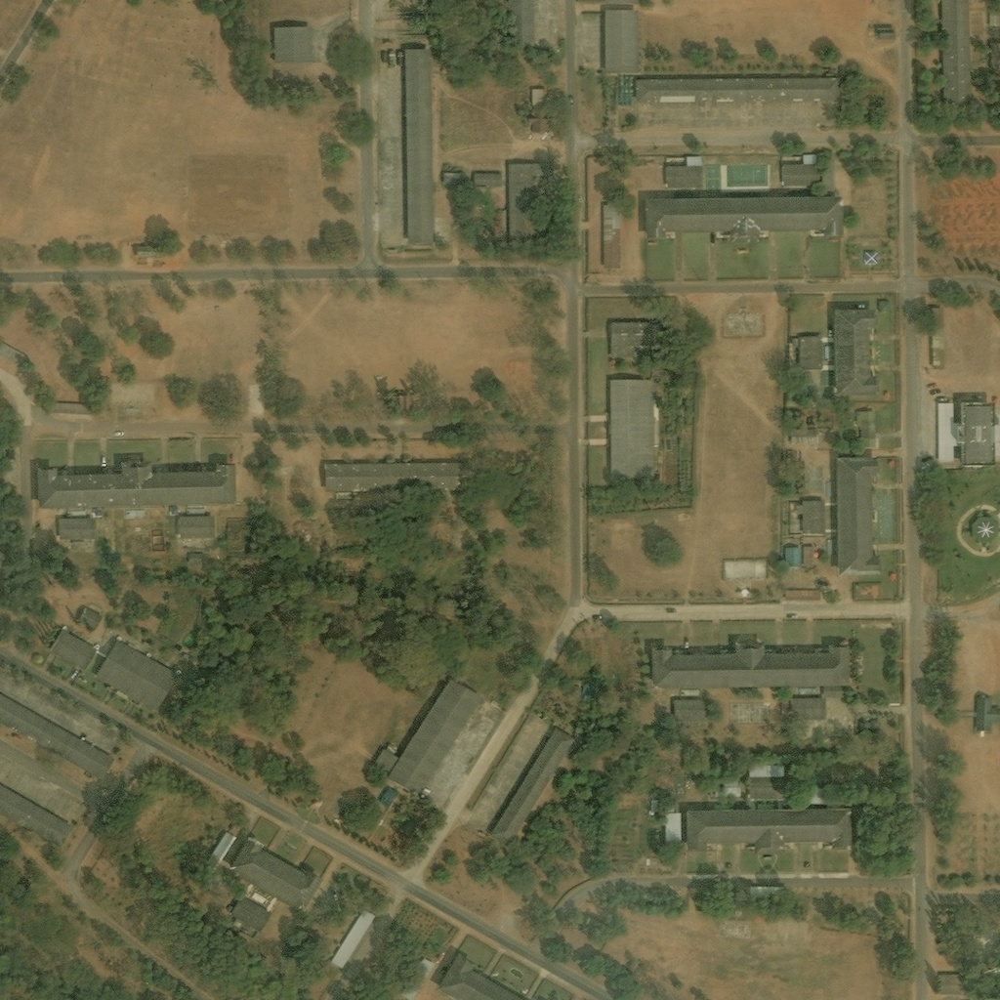
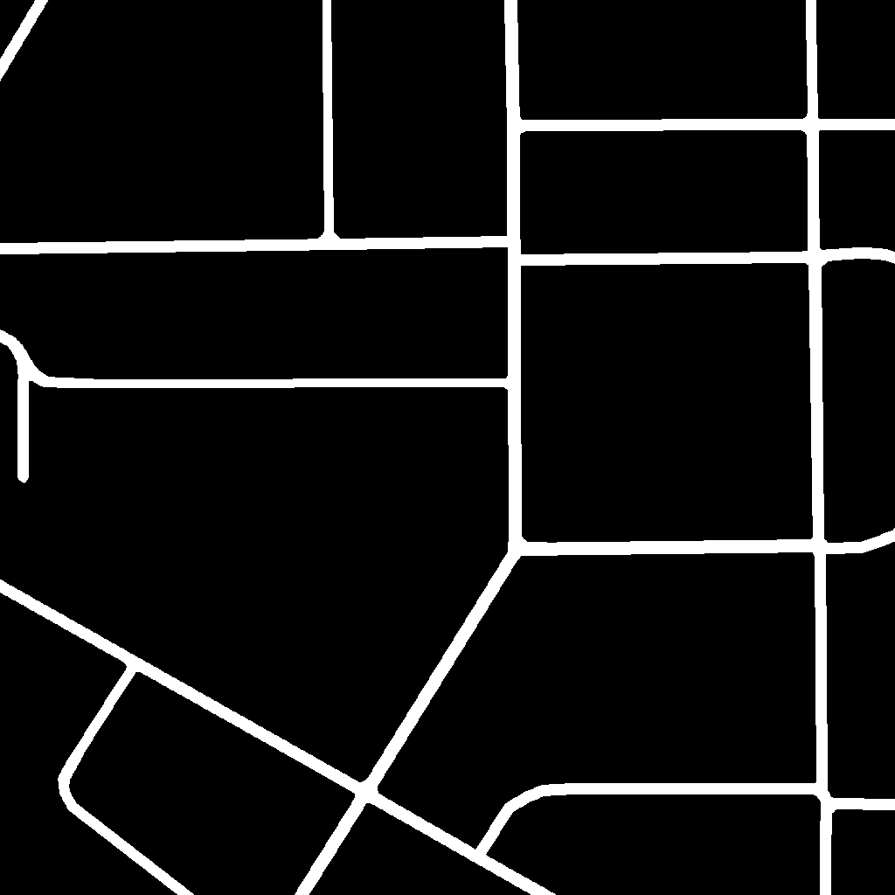

# 🛣️ Road Segmentation from Satellite Imagery

> Semantic segmentation of roads from satellite images using a U-Net architecture with a ResNet-34 encoder, trained on the DeepGlobe Road Extraction Dataset.


# Example 

<p align="center">
  
  
</p>
---

## 📌 Overview

This project tackles **binary semantic segmentation** — given a satellite image, the model predicts a pixel-wise mask identifying road pixels vs. background. Roads are thin, highly variable structures that are challenging to detect, making this a non-trivial computer vision problem.

**Key highlights:**
- U-Net with pretrained ResNet-34 encoder (ImageNet weights)
- Combined Dice + BCE loss to handle severe class imbalance (roads are tiny vs. background)
- Albumentations-based augmentation pipeline for robust training
- Morphological post-processing to clean up predicted masks
- Trained for 50 epochs with cosine annealing LR scheduler

---

## 🗂️ Project Structure

```
road-segmentation/
│
├── notebook14f93ec336.ipynb   # Full training & inference notebook
├── requirements.txt           # Python dependencies
├── README.md                  # You are here
│
├── docs/
│   └── approach.md            # Detailed technical write-up
│
└── samples/                   # Sample predictions (add your outputs here)
    └── prediction_grid.png
```

---

## 🧠 Model Architecture

| Component        | Detail                              |
|------------------|-------------------------------------|
| Architecture     | U-Net                               |
| Encoder          | ResNet-34 (pretrained on ImageNet)  |
| Input Size       | 512 × 512 × 3                       |
| Output           | 512 × 512 × 1 (binary mask)         |
| Parameters       | ~24M                                |
| Framework        | PyTorch + segmentation-models-pytorch |

The U-Net's skip connections preserve fine spatial detail — critical for detecting thin road structures that would otherwise be lost in deep downsampling.

---

## 📊 Training Configuration

| Hyperparameter   | Value                        |
|------------------|------------------------------|
| Epochs           | 50                           |
| Batch Size       | 16                           |
| Learning Rate    | 1e-4 (cosine annealing)      |
| Optimizer        | AdamW (weight decay = 1e-5)  |
| Loss Function    | Dice Loss + Soft BCE         |
| Train / Val / Test Split | 80% / 10% / 10%      |
| Image Size       | 512 × 512                    |

---

## 📈 Results

| Metric       | Value  |
|--------------|--------|
| Val IoU      | tracked per epoch |
| Val F1 Score | tracked per epoch |
| Loss         | Dice + BCE (combined) |

> 💡 To see exact numbers, run the notebook on Kaggle with the DeepGlobe dataset. Best model checkpoint is saved automatically during training.

---

## 🔧 Data Augmentation

Training uses a rich augmentation pipeline via [Albumentations](https://albumentations.ai/):

- Horizontal & Vertical Flip
- Random 90° Rotation
- Shift / Scale / Rotate
- Random Brightness & Contrast
- Gaussian Noise & Blur
- ImageNet normalization

---

## 🧹 Post-Processing

Raw model predictions are refined using morphological operations:
1. **Binarization** at threshold 0.5
2. **Morphological Opening** — removes small false positive noise
3. **Morphological Closing** — fills small gaps in road predictions

---

## 🚀 Getting Started

### 1. Clone the repo
```bash
git clone https://github.com/yashkassa/road-segmentation.git
cd road-segmentation
```

### 2. Install dependencies
```bash
pip install -r requirements.txt
```

### 3. Download the dataset
Get the [DeepGlobe Road Extraction Dataset](https://www.kaggle.com/datasets/balraj98/deepglobe-road-extraction-dataset) from Kaggle and place it at:
```
data/train/
  ├── <id>_sat.jpg   ← satellite image
  └── <id>_mask.png  ← binary road mask
```

### 4. Run the notebook
Open `notebook14f93ec336.ipynb` in Jupyter or Kaggle and run all cells top to bottom.

---

## 📦 Requirements

See [`requirements.txt`](requirements.txt) for full list. Core dependencies:

```
torch
segmentation-models-pytorch
albumentations
opencv-python
librosa
matplotlib
tqdm
```

---

## 📚 References

- [U-Net: Convolutional Networks for Biomedical Image Segmentation](https://arxiv.org/abs/1505.04597) — Ronneberger et al.
- [DeepGlobe Road Extraction Dataset](https://www.kaggle.com/datasets/balraj98/deepglobe-road-extraction-dataset)
- [segmentation-models-pytorch](https://github.com/qubvel/segmentation_models.pytorch)
- [Albumentations](https://albumentations.ai/)

---

## 👤 Author

**Yash Kassa**  
Flutter & Full-Stack Developer | ML Enthusiast  
[GitHub](https://github.com/yashkassa) · [LinkedIn](https://linkedin.com/in/yash-kassa-137773232)

---

## 📄 License

This project is licensed under the MIT License — see the [LICENSE](LICENSE) file for details.
